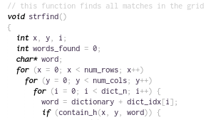

# Clear Skies
Minimalistic color scheme for Sublime Text 3.



## Tested languages
 * [JavaScript (Babel)](https://packagecontrol.io/packages/Babel)
 * HTML
 * XML
 * JSON

## Suggested settings

```json
{
    "caret_extra_bottom": 1,
    "caret_extra_top": 1,
    "caret_extra_width": 1,
    "caret_style": "smooth",
    "font_face": "Inconsolata LGC",
    "font_size": 11,
    "highlight_line": true
}
```

## Works well with
 * [Inconsolata LGC](https://github.com/MihailJP/Inconsolata-LGC/releases)
 * [WordHighlight](https://github.com/SublimeText/WordHighlight)
